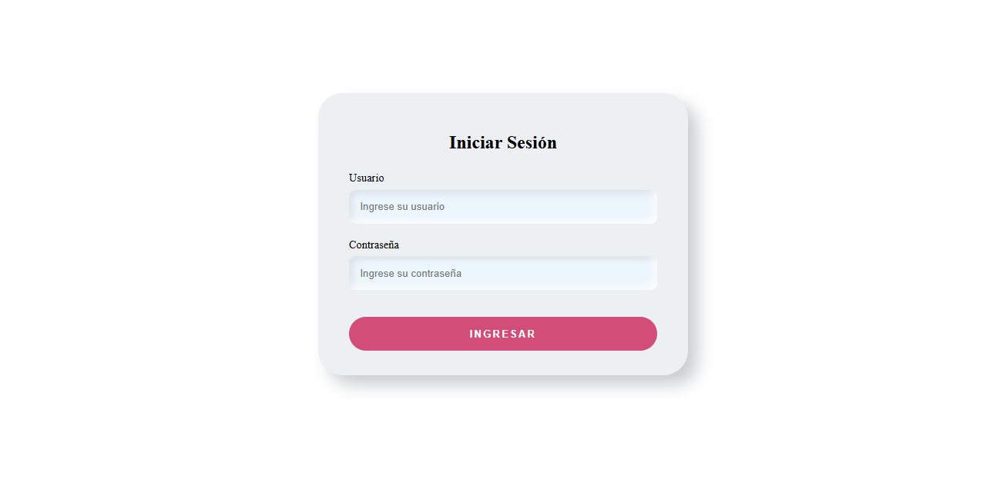
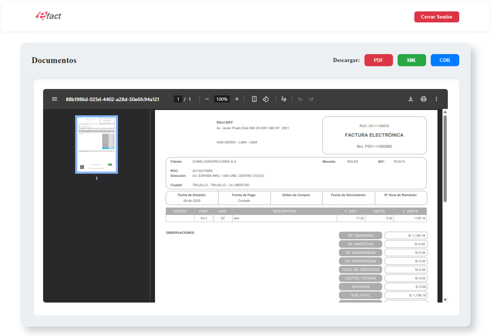

# Prueba Efact - Aplicación Frontend Angular

Frontend para la visualizacion de documentos electrónicos (PDF, XML, CDR) utilizando la API de Efact

## Tecnologías 

- Angular 17
- TypeScript
- HttpClient 
- RxJS

## Funcionalidades

### 1. Login
- Formulario de autenticación con validación
- Manejo de errores de credenciales
- Redirección automática después del login

### 2. Visualización de Documentos
- Botones para PDF, XML y CDR
- Vista previa de archivos XML y CDR en formato texto
- Vista previa de PDF en iframe embebido
- Estados de carga y error

### 3. Navbar
- Logo de la empresa
- Botón de cerrar sesión
- Solo visible en rutas autenticadas

## Endpoints de la API

POST 
    `/api-efact-ose/oauth/token` - Obtener token de acceso
GET 
    `/api-efact-ose/v1/xml/{ticket}` - Obtener archivo XML
    `/api-efact-ose/v1/cdr/{ticket}` - Obtener archivo CDR
    `/api-efact-ose/v1/pdf/{ticket}` - Obtener archivo PDF

## Screenshots

### Login


### Visualización de Documentos


## Requisitos pre-instalacion

- Node.js (v18 o superior)
- Angular CLI (`npm install -g @angular/cli`)

## Instalación

1. **Clonar el repositorio**
   ```bash
   git clone <url-del-repositorio>
   cd Efact-Angular-Prueba
   ```

2. **Instalar dependencias**
   ```bash
   npm install
   ```

3. **Configurar el proxy**
   
   El archivo `proxy.conf.json` ya está configurado:
   ```json
   {
     "/api-efact-ose": {
       "target": "https://odin-dev.efact.pe",
       "secure": true,
       "changeOrigin": true
     }
   }
   ```

4. **Iniciar el servidor de desarrollo**
   ```bash
   ng serve
   ```

5. **Abrir en el navegador**
   ```
   http://localhost:4200
   ```

6. **Utilizar credenciales brindados**


